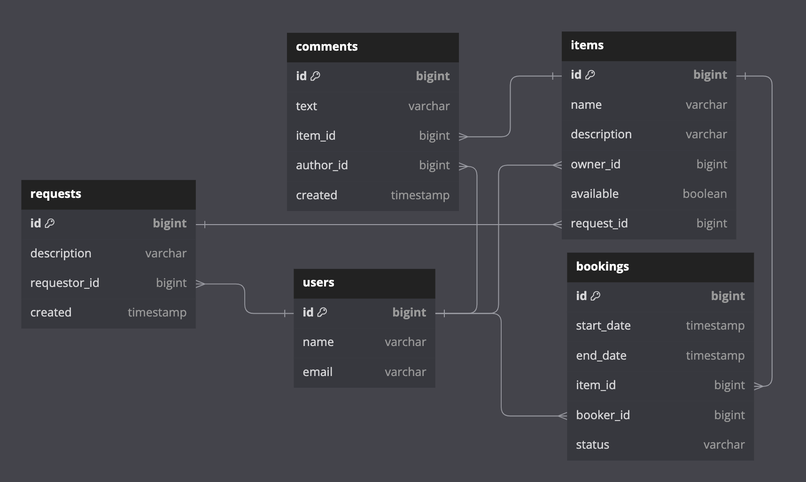

# java-shareit
### Сервис для обмена вещами.
> Rest-сервис с использованием Spring Boot, Maven, Hibernate, Lombok, PostgreSQL, H2, Docker, JUnit, Mockito

Сервис дает пользователям возможность: 
- рассказывать, какими вещами они готовы поделиться, 
- находить нужную вещь и брать её в аренду на какое-то время.

Сервис позволяет бронировать вещь на определённые даты и закрывать к ней доступ на время бронирования от других желающих. 
На случай, если нужной вещи на сервисе нет, у пользователей есть возможность оставлять запросы. 
По запросу можно добавлять новые вещи для шеринга.

**Функционал:** добавление, обновление, просмотр и удаление пользователей, вещей, запросов на аренду, комментариев к вещам.

### ER-диаграмма

<a href="server/src/main/resources/static/er.png">Ссылка на диаграмму</a>

### Описание БД

#### users
Содержит данные о пользователях.

**Поля:**
* первичный ключ id — идентификатор записи;
* name — уникальное имя пользователя
* email — уникальный email 

#### items
Содержит данные о вещах для аренды

**Поля:**
* первичный ключ id — идентификатор записи;
* name — название вещи
* description — описание вещи
* owner_id — id владельца вещи
* available — доступность для бронирования
* request_id — id запроса на вещь (если вещь появилась по запросу)

#### comments
Содержит данные о комментариях к вещам. Оставить комментарий можно только если пользователь бронировал вещь.

**Поля:**
* первичный ключ id — идентификатор записи;
* text — текст комментария
* item_id — id вещи
* author_id — id автора комментария
* owner_id — id владельца вещи
* available — доступность для бронирования
* request_id — id запроса на вещь (если вещь появилась по запросу)

#### bookings
Содержит данные о бронированиях вещей

**Поля:**
* первичный ключ id — идентификатор записи;
* start_date — дата начала бронирования
* * start_date — дата начала бронирования
* item_id — id вещи для бронирования
* booker_id — id бронирующего пользователя
* status — статус бронирования (WAITING / APPROVED / REJECTED / CANCELED)